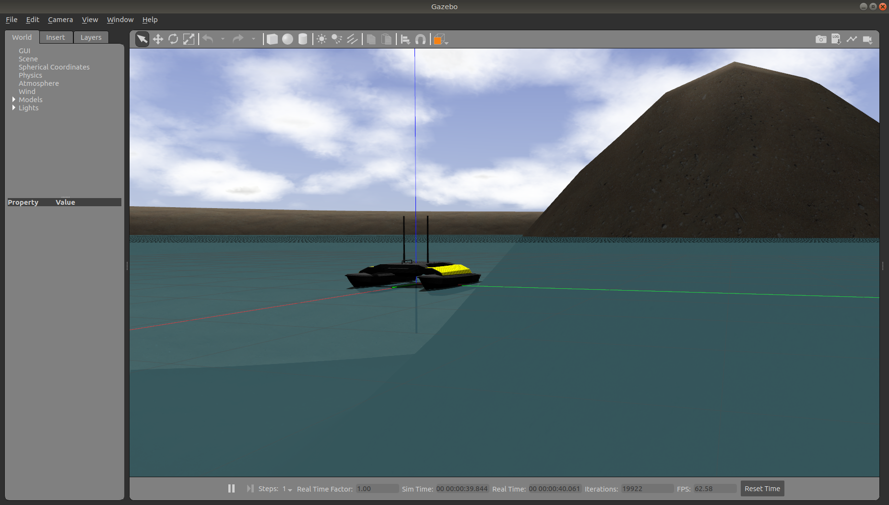
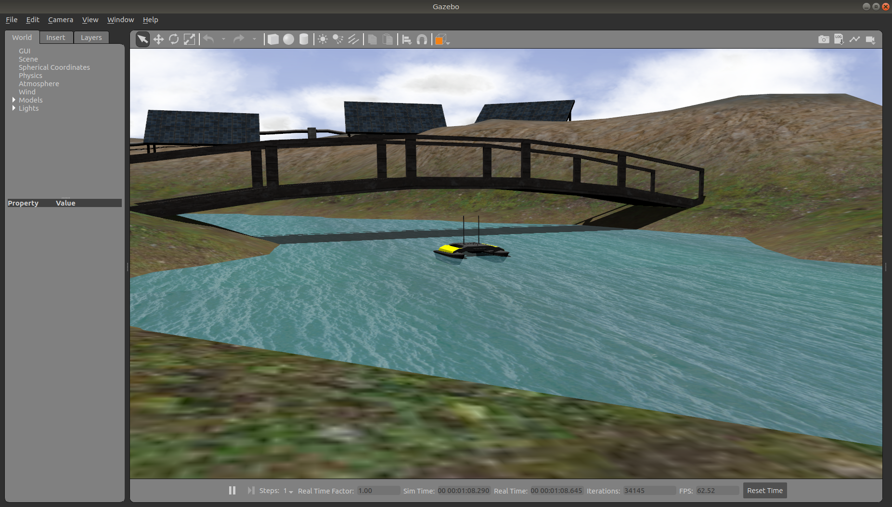

Additional Simulation Worlds
================================

In addtion to the default ``heron_world.launch`` file, ``heron_gazebo`` contains two additional launch files:

* ``heron_lake_world.launch``, which spawns Heron in an enclosed lake with small islands; and
* ``spawn_heron.launch``, which is intended to be included in any custom world to add a Heron simulation to it.

To add a Heron to any of your own worlds, simply include the ``spawn_heron.launch`` file in your own world's launch:

.. code-block:: xml

  <include file="$(find heron_gazebo)/launch/spawn_heron.launch">
    <!-- Optionally configure the spawn position -->
    <arg name="x" value="$(arg x)"/>
    <arg name="y" value="$(arg y)"/>
    <arg name="z" value="$(arg z)"/>
    <arg name="yaw" value="$(arg yaw)"/>
  </include>

Finally, Clearpath provides an additional suite of simulation environments that can be downloaded separately and used
with Heron, as described below.

Clearpath Gazebo Worlds
------------------------

The Clearpath Gazebo Worlds collection contains 4 different simulation worlds, representative of different
environments our robots are designed to operate in:

* Inspection World: a hilly outdoor world with water and a cave
* Agriculture World: a flat outdoor world with a barn, fences, and solar farm
* Office World: a flat indoor world with enclosed rooms and furniture
* Construction World: office world, under construction with small piles of debiris and partial walls

Heron is only supported in Inspection World, as this is the only environment which features water.

Installation
---------------

To download the Clearpath Gazebo Worlds, clone the repository from github into the same workspace as your Heron:

.. code-block:: bash

  cd ~/catkin_ws/src
  git clone https://github.com/clearpathrobotics/cpr_gazebo.git

Before you can build the package, make sure to install dependencies.  Because Clearpath Gazebo Worlds depends on
all of our robots' simulation packages, and some of these are currently only available as source code, installing
dependencies with ``rosdep install --from-paths [...]`` will likely fail.

All four simulation environments need the ``gazebo_ros`` package.  The Inspection World also needs the ``uuv_gazebo_worlds``
package, which can be installed by running

.. code-block:: bash

  sudo apt-get install ros-$ROS_DISTRO-uuv-gazebo-worlds

Once the dependencies are installed, you can build the package:

.. code-block:: bash

  cd ~/catkin_ws
  catkin_make
  source devel/setup.bash

Running the Inspection Simulation
------------------------------------

Inspection World is a hilly, outdoor world that includes a water feature, bridge, pipeline, small cave/mine,
and a small solar farm.  It is intended to simulate a variety of missions, including pipeline inspection,
cave/underground navigation, and localization on non-planar terrain.

To launch the inspection simulation, run

.. code-block:: bash

  roslaunch cpr_inspection_gazebo inspection_world.launch platform:=heron

To customize Heron's payload, for example to add additional sensors, you must set the environment variables described in
:doc:`description`.  You can also extend Heron's model by creating a custom URDF file and setting ``HERON_URDF_EXTRAS``
to point to this file's location on your computer.

Once the simulation is running you can use rviz and other tools as described in :doc:`simulation`
to control and monitor the robot.
