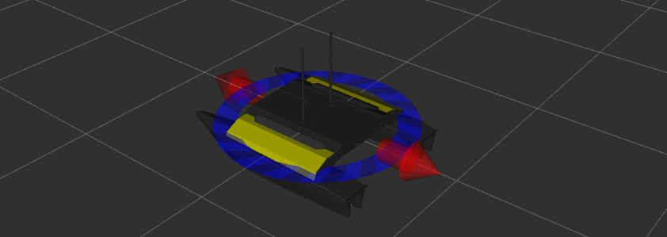

heron_description Package
===========================

The heron_description package is the URDF robot description for Heron USV.

.. _Source: https://github.com/heron/heron

Overview
---------

This package provides a `URDF <http://wiki.ros.org/urdf>`_ model of Heron.  For an example launchfile to use in visualizing this model, see `heron_viz <http://wiki.ros.org/heron_viz>`_.

Accessories
------------

Heron has a suite of optional payloads called accessories. These payloads can be enabled and placed on Herib using environment variables specified at the time the `xacro <http://wiki.ros.org/xacro>`_ is rendered to URDF. Available accessory vars are:

.. raw:: html

    <table><tbody><tr>  <td>
<strong>Variable</strong> 
</td>
      <td>
<strong>Default</strong> 
</td>
      <td>
<strong>Description</strong> 
</td>
    </tr>
    <tr>  <td>
<tt>HERON_URDF_EXTRAS</tt> 
</td>
      <td>
<tt>empty.urdf</tt> 
</td>
      <td>
Path to a URDF file to add additional joints/links/accessories to Heron's model
</td>
    </tr>
    <tr>  <td>
<tt>HERON_IMU_UM6_PORT</tt> 
</td>
      <td>
<tt>/dev/clearpath/imu</tt> 
</td>
      <td>
The file that the Heron's UM6 IMU is mapped to
</td>
    </tr>
    <tr>  <td>
<tt>HERON_IMU_UM6_XYZ</tt> 
</td>
      <td>
<tt>-0.1397 0 0</tt> 
</td>
      <td>
XYZ offset of the IMU relative to its mount
</td>
    </tr>
    <tr>  <td>
<tt>HERON_IMU_UM6_RPY</tt> 
</td>
      <td>
<tt>0 0 -0</tt> 
</td>
      <td>
RPY offset of the IMU relative to its mount
</td>
    </tr>
    <tr>  <td>
<tt>HERON_NAVSAT_UBLOX_PORT</tt> 
</td>
      <td>
<tt>/dev/ublox</tt> 
</td>
      <td>
The file that the Heron's GPS is mapped to
</td>
    </tr>
    <tr>  <td>
<tt>HERON_NAVSAT_UBLOX_BAUD</tt> 
</td>
      <td>
<tt>115200</tt> 
</td>
      <td>
The baud rate the Heron's GPS uses
</td>
    </tr>
    <tr>  <td>
<tt>HERON_NAVSAT_UBLOX_SOCKET</tt> 
</td>
      <td>
<tt>0</tt> 
</td>
      <td>
If true (1), enable communicating with the GPS over a socket instead of serial
</td>
    </tr>
    <tr>  <td>
<tt>HERON_NAVSAT_UBLOX_SOCKET_PORT</tt> 
</td>
      <td>
<tt>2525/tt> 
</td>
      <td>
The network port to use for communicating with the GPS if <tt>HERON_NAVSAT_UBLOX_SOCKET</tt> is set to <tt>1</tt>
</td>
    </tr>
    <tr>  <td>
<tt>HERON_NAVSAT_UBLOX_RTCM</tt> 
</td>
      <td>
<tt>false</tt> 
</td>
      <td>
???
</td>
    </tr>
    <tr>  <td>
<tt>HERON_NAVSAT_UBLOX_XYZ</tt> 
</td>
      <td>
<tt>0.015 0.050 0.072</tt> 
</td>
      <td>
XYZ offset of the Ublox GPS to its mount
</td>
    </tr>
    <tr>  <td>
<tt>HERON_NAVSAT_UBLOX_RPY</tt> 
</td>
      <td>
<tt>0 0 -0</tt> 
</td>
      <td>
RPY offset of the Ublox GPS relative to its mount
</td>
    </tr>
    <tr>  <td>
<tt>HERON_NAVSAT_SMART6</tt> 
</td>
      <td>
<tt>0</tt> 
</td>
      <td>
Set to <tt>1</tt> if Heron is equipped with a Smart6 GPS
</td>
    </tr>
    <tr>  <td>
<tt>HERON_NAVSAT_SMART6_PORT</tt> 
</td>
      <td>
<tt>/dev/clearpath/gps</tt> 
</td>
      <td>
The file the Smart6 GPS is mapped to
</td>
    </tr>
    <tr>  <td>
<tt>HERON_NAVSAT_SMART6_BAUD</tt> 
</td>
      <td>
<tt>57600</tt> 
</td>
      <td>
The baud rate the Smart6 GPS uses
</td>
    </tr>
    <tr>  <td>
<tt>HERON_NAVSAT_SMART6_MOUNT</tt> 
</td>
      <td>
<tt>rear</tt> 
</td>
      <td>
Prepended to <tt>_navsat</tt> to indicate what link the Smart6 GPS is connected to on the robot
</td>
    </tr>
    <tr>  <td>
<tt>HERON_NAVSAT_SMART6_OFFSET</tt> 
</td>
      <td>
<tt>-0.25 0 0.08</tt> 
</td>
      <td>
XYZ offsets for the Smart6 GPS relative to its mount
</td>
    </tr>
    <tr>  <td>
<tt>HERON_NAVSAT_SMART6_RPY</tt> 
</td>
      <td>
<tt>0 0 0</tt> 
</td>
      <td>
RPY offsets for the Smart6 GPS relative to its mount
</td>
    </tr>
    <tr>  <td>
<tt>HERON_NAVSAT_SMART6_RTK</tt> 
</td>
      <td>
<tt>0</tt> 
</td>
      <td>
???
</td>
    </tr>
    <tr>  <td>
<tt>HERON_NAVSAT_SMART6_RTK_DEVICE</tt> 
</td>
      <td>
<tt>wlan0</tt> 
</td>
      <td>
???
</td>
    </tr>
    <tr>  <td>
<tt>HERON_LASER</tt> 
</td>
      <td>
<tt>0</tt> 
</td>
      <td>
Set to <tt>1</tt> if Heron is equipped with a lidar unit
</td>
    </tr>
    <tr>  <td>
<tt>HERON_LASER_HOST</tt> 
</td>
      <td>
<tt>192.168.131.14</tt> 
</td>
      <td>
The internal IP address of the Heron's lidar
</td>
    </tr>
    <tr>  <td>
<tt>HERON_LASER_MOUNT</tt> 
</td>
      <td>
<tt>front</tt> 
</td>
      <td>
Prepended to <tt>_laser</tt> to indicate the link the lidar is mounted to
</td>
    </tr>
    <tr>  <td>
<tt>HERON_LASER_OFFSET</tt> 
</td>
      <td>
<tt>0.0575 0 0.0115</tt> 
</td>
      <td>
XYZ offsets for the lidar relative to its mount
</td>
    </tr>
    <tr>  <td>
<tt>HERON_LASER_RPY</tt> 
</td>
      <td>
<tt>0 0 0</tt> 
</td>
      <td>
RPY offsets for the lidar relative to its mount
</td>
    </tr>
    <tr>  <td>
<tt>HERON_LASER_TOPIC</tt> 
</td>
      <td>
<tt>front/scan</tt> 
</td>
      <td>
The ROS topic the lidar data is published to
</td>
    </tr>
    <tr>  <td>
<tt>HERON_AXIS_PTZ</tt> 
</td>
      <td>
<tt>0</tt> 
</td>
      <td>
Set to <tt>1</tt> if Heron is equipped with PTZ camera
</td>
    </tr>
    <tr>  <td>
<tt>HERON_AXIS_PTZ_NAME</tt> 
</td>
      <td>
<tt>axis_ptz</tt> 
</td>
      <td>
ROS namespace for topics published by the PTZ camera
</td>
    </tr>
    <tr>  <td>
<tt>HERON_AXIS_PTZ_HOST</tt> 
</td>
      <td>
<tt>192.168.131.13</tt> 
</td>
      <td>
Internal IP address of the PTZ camera
</td>
    </tr>
    <tr>  <td>
<tt>HERON_AXIS_PTZ_WIDTH</tt> 
</td>
      <td>
<tt>1280</tt> 
</td>
      <td>
Horizontal resolution of the PTZ camera
</td>
    </tr>
    <tr>  <td>
<tt>HERON_AXIS_PTZ_HEIGHT</tt> 
</td>
      <td>
<tt>720</tt> 
</td>
      <td>
Vertical resolution of the PTZ camera
</td>
    </tr>
    <tr>  <td>
<tt>HERON_AXIS_PTZ_ENABLE_PTZ</tt> 
</td>
      <td>
<tt>1</tt> 
</td>
      <td>
Set to <tt>0</tt> to disable the PTZ controls and use a fixed-position camera
</td>
    </tr>
    <tr>  <td>
<tt>HERON_AXIS_PTZ_ENABLE_THEORA</tt> 
</td>
      <td>
<tt>0</tt> 
</td>
      <td>
Set to <tt>1</tt> to enable Ogg/Theora video streaming from the camera
</td>
    </tr>
    <tr>  <td>
<tt>HERON_AXIS_PTZ_ENABLE_TELEOP</tt> 
</td>
      <td>
<tt>1</tt> 
</td>
      <td>
Set to <tt>0</tt> to disable remote teleop control of the PTZ functions
</td>
    </tr>
    <tr>  <td>
<tt>HERON_PTZ_MOUNT</tt> 
</td>
      <td>
<tt>axis_ptz</tt> 
</td>
      <td>
Prepended to <tt>_camera_link</tt> to indicate the link the PTZ camera is mounted to
</td>
    </tr>
    <tr>  <td>
<tt>HERON_PTZ_OFFSET</tt> 
</td>
      <td>
<tt>-0.124 0 0.078</tt> 
</td>
      <td>
XYZ offsets for the PTZ camera relative to its mount
</td>
    </tr>
    <tr>  <td>
<tt>HERON_PTZ_RPY</tt> 
</td>
      <td>
<tt>0 0 0</tt> 
</td>
      <td>
RPY offsets for the PTZ camera relative to its mount
</td>
    </tr>
    <tr>  <td>
<tt>HERON_SONAR</tt> 
</td>
      <td>
<tt>0</tt> 
</td>
      <td>
Set to <tt>1</tt> if Heron is equipped with underwater sonar
</td>
    </tr>
    <tr>  <td>
<tt>HERON_SONAR_PORT</tt> 
</td>
      <td>
<tt>/dev/ttyS4</tt> 
</td>
      <td>
The serial port the sonar is connected to
</td>
    </tr>
    <tr>  <td>
<tt>HERON_SONAR_BAUD</tt> 
</td>
      <td>
<tt>19200</tt> 
</td>
      <td>
The baud rate the sonar uses
</td>
    </tr>
    <tr>  <td>
<tt>HERON_SONAR_ROS</tt> 
</td>
      <td>
<tt>1</tt> 
</td>
      <td>
Set to <tt>0</tt> to disable publishing sonar data as ROS topics
</td>
    </tr>
    <tr>  <td>
<tt>HERON_SONAR_MOUNT</tt> 
</td>
      <td>
<tt>rear</tt> 
</td>
      <td>
Indicates where the sonar is mounted to the robot
</td>
    </tr>
    <tr>  <td>
<tt>HERON_SONAR_OFFSET</tt> 
</td>
      <td>
<tt>0 0 -0.1</tt> 
</td>
      <td>
XYZ offset of the sonar relative to its mount
</td>
    </tr>
    <tr>  <td>
<tt>HERON_SONAR_RPY</tt> 
</td>
      <td>
<tt>0 0 -0</tt> 
</td>
      <td>
RPY offset of the sonar relative to its mount
</td>
    </tr>
    </tbody></table>
