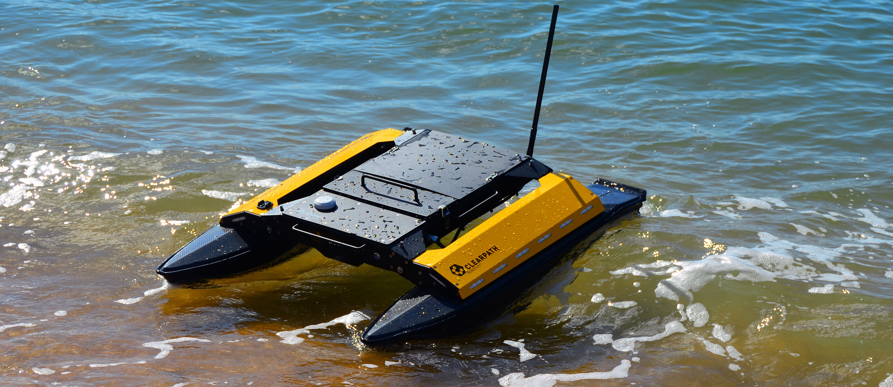

Heron USV Tutorials
======================

This package supplies Sphinx-based tutorial content to assist you with setting up and operating your Heron_
mobile robot. The tutorials topics are listed in the left column, and presented in the suggested reading order.

.. _Heron: http://www.clearpathrobotics.com/heron/

.. Warning::
  These tutorials assume that you are comfortable working with ROS.  We recommend starting with our
  `ROS tutorial <./../ros>`_ if you are not familiar with ROS already.

:doc:`Simulation <simulation>` is a logical place for most users to start, as this is universally applicable;
understanding how to effectively operate Heron in simulation is valuable whether you are in the testing
phase with software you intend to ultimately deploy on a real Heron, or you do not have one and are
simply exploring the platform's capabilities.

The remainder of the subjects are more applicable to the real robot, and have to do with configuring, using,
and maintaining the platform. If you are a lab administrator rather than direct platform user, you may wish to
skip the introductory chapters and jump straight to these ones.

.. toctree::
    :titlesonly:
    :hidden:
    :caption: Getting Started

    Overview <self>
    simulation
    network
    startup
    calibration
    update

.. toctree::
    :titlesonly:
    :hidden:
    :caption: Heron Packages

    description
