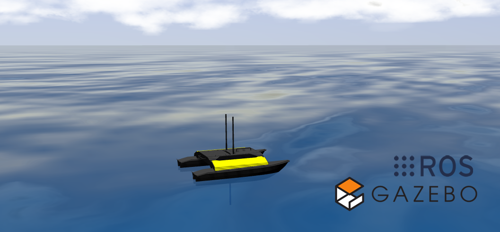
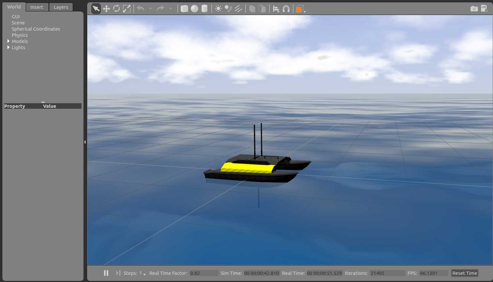
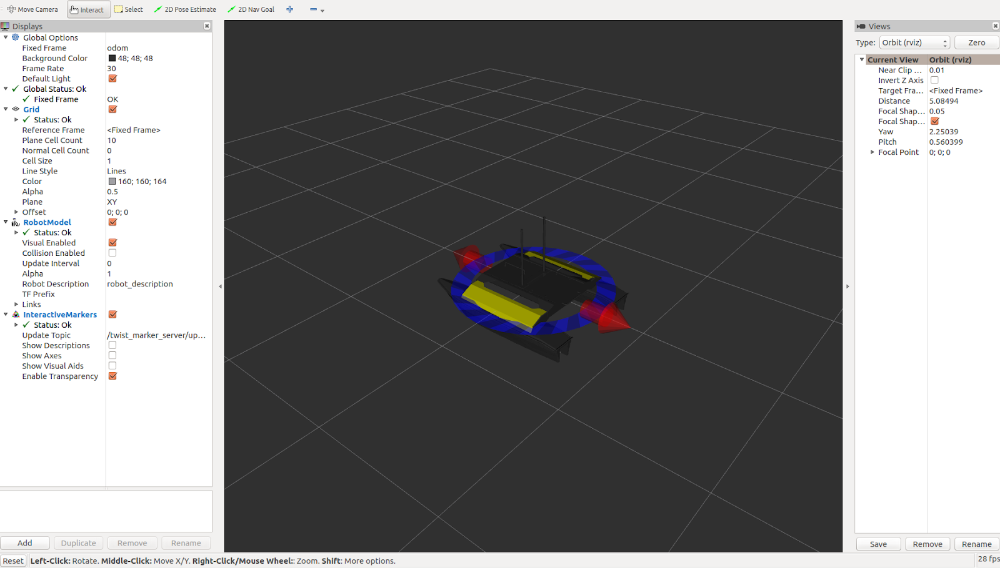

Simulating Heron
=================

Whether you actually have a Heron robot or not, the Heron simulator is a great way to get started with ROS
robot development. In this tutorial, we will go through the basics of starting Gazebo and Rviz and how to drive
your Heron around.

Installation
------------

To get started with the Heron simulation, make sure you have a :roswiki:`working ROS installation <ROS/Installation>`
set up on your Ubuntu desktop, and install the Heron-specific metapackages for desktop and simulation:

.. code:: bash

    sudo apt-get install ros-kinetic-heron-description ros-kinetic-heron-viz ros-kinetic-heron-desktop

Then install the ROS unmanned underwater vehicles simulation package:

.. code:: bash

    sudo apt-get install ros-kinetic-uuv-simulator

Finally, create a catkin workspace and checkout the heron_simulation package and build it:

.. note::

    At present heron_simulation is only available from source.  At a future date we will publish a debian
    package to allow installation through apt.

.. code:: bash

    mkdir ~/catkin_ws
    cd ~/catkin_ws
    mkdir src
    catkin_init_workspace src
    cd src
    git clone https://github.com/heron/heron_simulator
    cd ~/catkin_ws
    rosdep install --from-paths src --ignore-src
    catkin_make

Launch Gazebo
-------------

Gazebo is the most common simulation tool used in ROS. Heron's model in Gazebo include reasonable
approximations of its dynamics, including inertia and buoyancy. To launch simulated
Heron in a simple example world, run the following command:

.. code-block:: bash

    roslaunch heron_gazebo heron_world.launch

You should see the following window appear, or something like it. You can adjust the camera angle by
clicking and dragging while holding CTRL, ALT, or the shift key:

The window which you are looking at is the Gazebo Client. This window shows you the "true" state of the
simulated world which the robot exists in. It communicates on the backend with the Gazebo Server, which
is doing the heavy lifting of actually maintaining the simulated world. At the moment, you're running
both the client and server locally on your own machine, but some advanced users may choose to run heavy
duty simulations on separate hardware and connect to them over the network.

Launch rviz
-----------

The next tool we will encounter is :roswiki:`rviz`. Although superficially similar in appearance to Gazebo,
rviz has a very different purpose— unlike Gazebo, which shows the reality of the simulated world, rviz shows
the robot's *perception* of its world, whether real or simulated. So while Gazebo won't be used with your
real Heron, rviz is used with both.

You can using the following launch invocation to start rviz with a pre-cooked configuration suitable for
visualizing any standard Heron config:

.. code-block:: bash

    roslaunch heron_viz view_robot.launch

You should see rviz appear:

The rviz display only shows what the robot knows about its world, which presently, is nothing. Because the
robot doesn't yet know about the barriers which exist in its Gazebo world, they're not shown here.

Driving Heron
--------------

What is shown, however, is Heron's interactive markers. These are the simplest way to command your robot
to move around. If you don't see them in your rviz display, select the Interact tool from the top toolbar.
You should see red arrows and a blue circle appear around the Heron model.

Drag the red arrows in Rviz to move in the linear x and the blue circle to move in the angular z. Rviz shows you
Heron moving relative to its odometric frame, but it is also moving relative to the simulated world supplied by
Gazebo. If you click over to the Gazebo window, you will see Heron moving within its simulated world. Or, if you
drive real Heron using this method, it will have moved in the real world.

Once you start your own development, have your nodes send ``geometry_msgs/Twist`` commands to the ``cmd_vel``
topic to drive Heron, either real or simulated.
